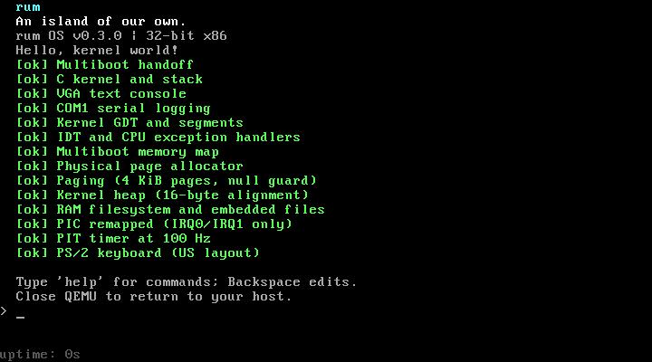
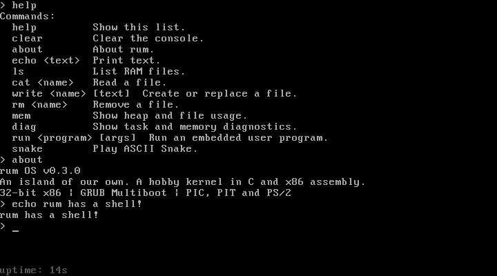
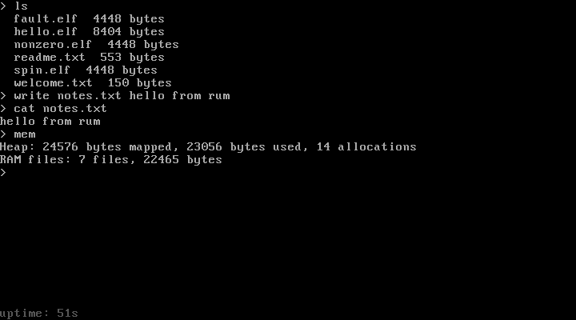
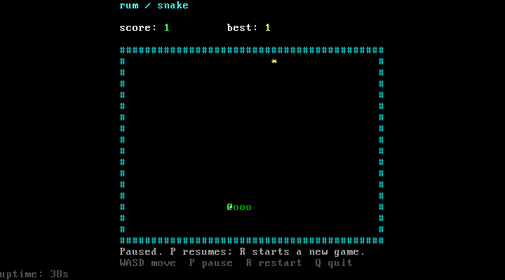

# rum

A small hobby operating system written in C and x86 assembly, named after
the Scottish island of Rùm.

rum boots through GRUB into a VGA text console with a shell, RAM files, protected
user programs, and ASCII Snake. It runs on a 32-bit x86 BIOS machine in QEMU.

## Screenshots

| Boot sequence | Shell |
| --- | --- |
|  |  |
| **RAM filesystem** | **ASCII Snake** |
|  |  |

## Getting started

The build environment is Ubuntu 24.04 on WSL 2. For the PowerShell launcher,
install QEMU on Windows and add it to `PATH`.

From the repository directory, set up the build tools once:

```powershell
.\rum.ps1 setup
```

Then check the environment and boot rum:

```powershell
.\rum.ps1 doctor
.\rum.ps1 run
```

The launcher builds in WSL and opens Windows QEMU. To build and run from Ubuntu
instead, use `make doctor` and `make run`. See [setup](docs/setup.md) for manual
installation, toolchain options, and troubleshooting.

## Using rum

Click inside QEMU and enter `help` at the `> ` prompt. Input uses a US QWERTY
layout; Enter runs a command, Backspace edits, and Tab inserts four spaces.
The bottom row shows uptime.

| Command | Description |
| --- | --- |
| `help` | List commands |
| `clear` | Clear the console |
| `about` | Show version and kernel information |
| `echo <text>` | Print text |
| `ls` | List RAM files |
| `cat <name>` | Read a file |
| `write <name> [text]` | Create or replace a file |
| `rm <name>` | Remove a file |
| `mem` | Show heap and filesystem usage |
| `diag` | Inspect tasks, paging, stacks and memory usage |
| `run <program> [args]` | Run an embedded user ELF in the foreground |
| `snake` | Play ASCII Snake |

Snake uses **WASD** to move, **P** to pause, **R** to restart, and **Q** to return
to the shell. Best scores are saved in `snake.score` for the current boot.

Files are stored in RAM. Rebooting restores the files embedded from
`assets/ramfs/` and discards changes. Add files there and rebuild to include them
in the kernel.

Close the QEMU window to exit. The default GTK/SDL interface releases captured
input with `Ctrl+Alt+G`.

## Kernel features

- GRUB Multiboot v1 boot with VGA text and COM1 output.
- Writable GDT/TSS, IDT, shared interrupt entry, and CPU exception diagnostics.
- PIC interrupts, a 100 Hz PIT timer, and PS/2 keyboard input.
- Cooperative kernel tasks with guarded virtual stacks, event waits, and deferred cleanup.
- A dedicated double-fault task and emergency stack for controlled overflow reports.
- A physical allocator for 4 KiB pages below 1 GiB.
- Supervisor paging with protected kernel pages and private user address spaces.
- Process records with positive PIDs, trusted user frames, and owned-resource accounting.
- Production ring-3 entry with isolated user-fault recovery and recorded fault state.
- A versioned `int 0x80` ABI with process exit, PID lookup, and validated console I/O.
- A page-backed heap with aligned allocation, resizing, and free-block reuse.
- A flat RAM filesystem with build-time file embedding.
- A separate freestanding user ELF build, production loader, and public ABI.
- Foreground user-process launch, waiting, fault reporting, cleanup, and Ctrl+C.

rum is a single-CPU system. The shell and Snake still run in ring 0; programs
started with `run` execute in ring 3. Persistent disk storage is planned work.

## Building and testing

| PowerShell | Ubuntu | Action |
| --- | --- | --- |
| `.\rum.ps1 build` | `make` | Build the kernel ELF and GRUB ISO |
| `.\rum.ps1 run` | `make run` | Boot the ISO |
| `.\rum.ps1 run-kernel` | `make run-kernel` | Boot the ELF directly |
| `.\rum.ps1 test` | `make test` | Run host and QEMU tests |
| `.\rum.ps1 debug` | `make debug` | Start paused with a GDB server on port 1234 |
| `.\rum.ps1 panic` | `make panic` | Boot a test kernel that triggers a panic |
| `.\rum.ps1 clean` | `make clean` | Remove generated build files |

Build outputs are `build/rum.elf` and `build/rum.iso`. Tests cover game rules,
shell input, memory allocation, RAM files, boot checks, CPU faults, ring-3
syscalls, foreground process outcomes, cleanup, and device interrupts. Every
isolated QEMU case runs with 16 and 64 MiB. The suite also boots the GRUB ISO
and direct ELF at 16, 64, 256, and 1152 MiB. Logs, memory dumps, and screenshots
are saved in `build/test-artifacts/`.

## Packaging

Build the ISO, then bundle it with the README and documentation. The packaging
script uses Python 3 and needs no additional packages.

On Windows:

```powershell
.\rum.ps1 build
python scripts/package.py
```

On Linux or in WSL:

```sh
make
python3 scripts/package.py
```

Validate the archive and its embedded ISO with `make test-package` on Linux or
WSL, or `py -3 tests/package-test.py` on Windows.

This creates `rum.zip` in the repository directory, replacing an existing
archive. Its contents are:

```text
rum.iso
README.md
docs/
```

After extracting the archive, boot it with:

```sh
qemu-system-i386 -m 64M -cdrom rum.iso
```

## Source

| Directory | Contents |
| --- | --- |
| `arch/i386/` | Startup assembly, CPU tables, interrupt stubs, paging, and linker script |
| `boot/grub/` | GRUB configuration |
| `kernel/` | Kernel entry, console, drivers, memory, filesystem, shell, and Snake |
| `include/rum/` | Kernel interfaces |
| `assets/ramfs/` | Embedded boot files |
| `scripts/` | Toolchain setup, environment checks, embedding, and QEMU tests |
| `tests/` | Host tests and isolated test kernels |
| `docs/` | Setup, usage, architecture, and contributor guides |

The project follows the boot and toolchain approach in
[OSDev Bare Bones](https://wiki.osdev.org/Bare_Bones). GRUB loads the kernel;
`arch/i386/boot.s` sets up its stack and CPU segments before calling C.

See the [documentation](docs/README.md) for subsystem details and debugging.
Persistent storage and userspace-shell plans are in the [roadmap](docs/roadmap.md).
